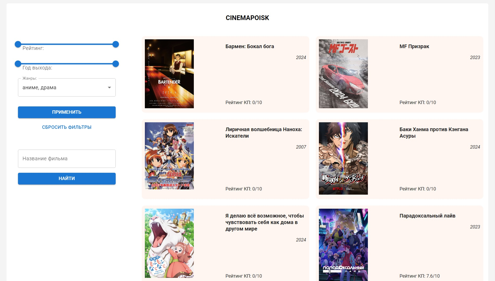
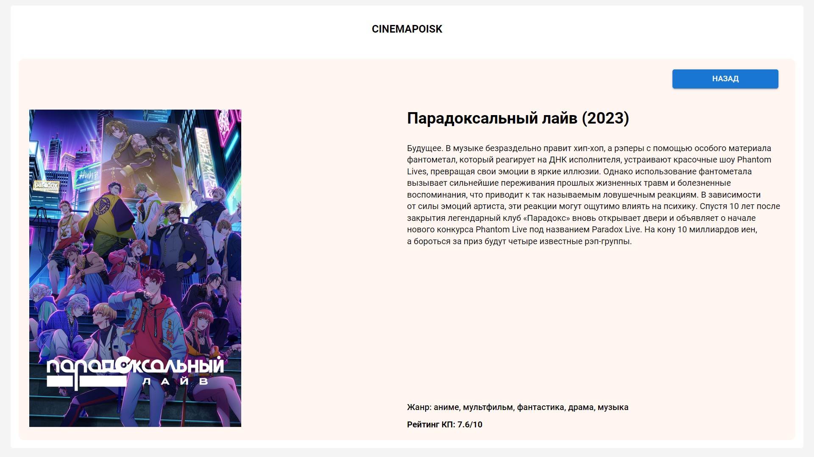

# «Cinemapoisk»

### Описание: Приложение для поиска информации о фильмах и сериалах из базы Кинопоиска API

### Использованные технологии:

- Typescript
- React
- SCSS
- Babel
- Webpack
- MUI

#### Для запуска на localhost использовать команду:

```
npm run start
```

### Главная страница

<!--   -->


### Страница с отдельным фильмом

<!--   -->

